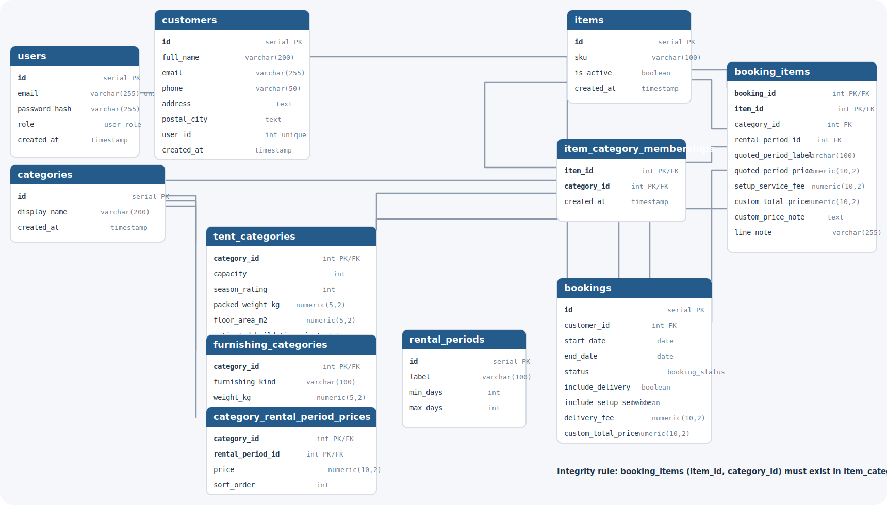

# Kada Tent Rental

Flask and PostgreSQL application for managing tent and furnishing rentals, inventory allocation, customer bookings, rental-period pricing, and delivery/setup add-ons.



## Overview

The project models real inventory units rather than abstract stock counts. Each `item` is a physical rentable unit, categories define how that unit is offered, and bookings allocate actual items for a date range.

Current database highlights:

- category pricing is defined per rental period
- categories are specialized into `tent_categories` or `furnishing_categories`
- items can belong to multiple categories through `item_category_memberships`
- booking lines store the selected category and validate the `(item_id, category_id)` pair against that membership table
- overlapping rentals for the same physical item are blocked in the database

## Stack

- Python
- Flask
- PostgreSQL
- Gunicorn
- Docker Compose

## Local Development

1. Create and activate a virtual environment.
2. Install dependencies with `pip install -r requirements.txt`.
3. Copy `.env.example` to `.env`.
4. Set at least `DATABASE_URL` and `SECRET_KEY`.
5. Create the database and apply `schema_postgres.sql` or run the SQL files in `migrations/`.
6. Start the app with `flask --app run.py --debug run`.

Optional environment variables:

- `MAP_API_KEY` and `DELIVERY_ORIGIN_ADDRESS` for delivery quotes
- `MAIL_ENABLED=1`, `SMTP_HOST`, `SMTP_PORT`, `SMTP_USERNAME`, `SMTP_PASSWORD`, and `SMTP_FROM_EMAIL` for booking emails

## Docker

Run a local container smoke test with:

```bash
docker compose up --build
```

The app is exposed on `http://localhost:8080`.

## Database

The canonical schema lives in `schema_postgres.sql`. Incremental changes are tracked in `migrations/`.

Main entities:

- `users` and optional linked `customers`
- `categories` with tent/furnishing subtype tables
- `rental_periods` and `category_rental_period_prices`
- `items` and `item_category_memberships`
- `bookings` and `booking_items`

The database diagram above reflects the current many-to-many item/category model and the booking validation rule:

`booking_items(item_id, category_id) -> item_category_memberships(item_id, category_id)`

## Seed Data

After the schema is applied and `DATABASE_URL` is configured, load demo data with:

```bash
python seed.py
```

The seed script:

- creates an admin user: `karl.wikell@gmail.com` / `DV1703`
- creates a customer user: `hej.hej@hej.hej` / `DV1703`
- inserts demo tents, furnishings, rental periods, and pricing data

## Deployment

Production deployment is container-based.

- `docker/entrypoint.sh` runs startup migrations
- `wsgi.py` exposes the WSGI entrypoint
- `gunicorn.conf.py` reads the injected `PORT`

Railway-specific deployment details are documented in `DEPLOY.md`.
